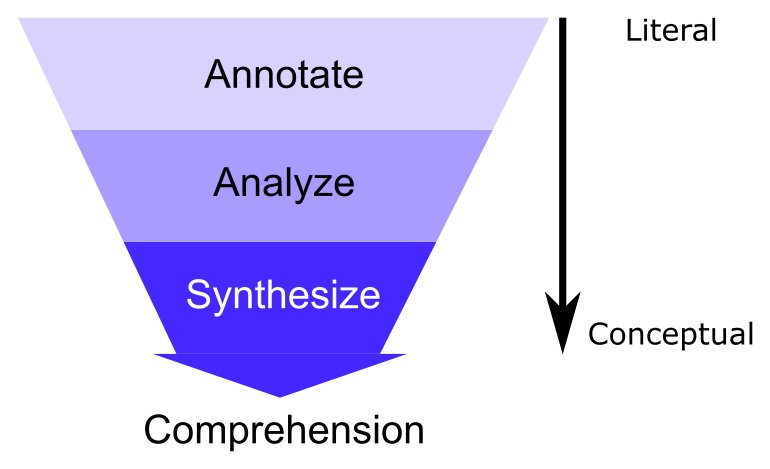

# BF/BI510: The Instrument

“The Instrument” is a tool we are developing in this class to help identify
potentially hidden biases in a text.

The Instrument is intended to simultaneously meet the following goals:

1. **Help you develop critical analysis skills** when reading texts.
2. **Help you build an intuition for identifying bias and opinions** in texts.
3. **Measure how your skills from 1 & 2 change over the course**
4. **Create a dataset of annotations for a corpus of documents** that capture the
   specific instances of bias-related aspects of the component texts

## Background & Rationale

Claims made in texts, be they news, opinion, or scientific articles, always
presume some set of assumptions are true. These assumptions may be explicitly
stated within the text itself, or implicitly held by the author. In any case,
the validity and veracity of the assumptions underlying a claim are not always
obvious to the reader and require exploration and additional investigation to
elucidate. This process of gathering information to place a text in its broader
context to better understand it (sometimes called "deep", "slow", or "close"
reading) requires time and effort, and while several strategies have been
proposed, no formal or rigorous approaches to performing this type of reading
are broadly accepted.

The scientific method itself is a process that may be employed to systematize a
deep reading of a text. In scientific articles, important pieces of existing
evidence are annotated with citations that provide the basis for the validity of
a claim or assumption. However, while the same approach may be employed in
fields and contexts outside scientific publications, this convention of
explicitly citing prior evidence within a text is not as commonplace. It may be
unclear in a text that a claim requiring substantiation has even been made,
which statements are opinions vs facts, etc, thus making it difficult to know
which statements to investigate. An intuition and sensibility for "sniffing out"
aspects of a text that are biased or unsubstantiated may be developed with
practice.

Another key component of the scientific method is data. Generally speaking, data
are gathered using instruments that measure specific quantities in a
standardized way thus allowing them to be meaningfully compared. For example,
a ruler measures distance using a standardized scale, e.g. inches, such that any
measurement taken with a ruler of the same scale may be compared, regardless of
when or where the ruler is used.

“The Instrument” combines these ideas of developing a systematic approach to
critical analysis of text and using a standardized set of "measurements" into
a tool for identifying and understanding a text with the goal of identifying
potentially hidden biases. The instrument is intended to simultaneously meet
the following goals:

1. **Help you develop critical analysis skills** when reading texts.
2. **Help you build an intuition for identifying bias and opinions** in texts.
3. **Measure how your skills from 1 & 2 change over the course**
4. **Create a dataset of annotations for a corpus of documents** that capture the
   specific instances of bias-related aspects of the component texts

## “The Instrument” Structure

It is a structured approach to reading a text that has the following phases:

1. [**Annotate**](assignments/annotate.html) -  label key words, phrases, or sentences with a controlled set
   of hashtags
2. **Analyze** - answer a set of short answer questions designed to identify key
   aspects of the text
3. **Synthesize** - write a short narrative reflection about the article guided
   by a set of scaffolding questions

We can think of these phases as moving from a detailed, literal examination to a
more conceptual understanding of the text, illustrated below.

For more information on how to apply The Instrument, please consult our
[user guide](https://docs.google.com/document/d/e/2PACX-1vSyYU0Cd_OycY620MWZuFo8Xlj8LgooJaLM_LPG22Ftp7ROU-96WjW8xHmehHR1INwGib5pmHlkdFpP/pub)
